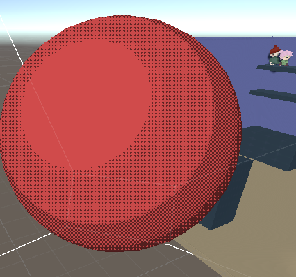
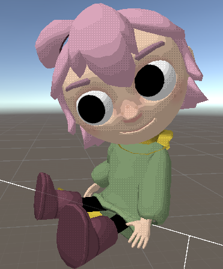
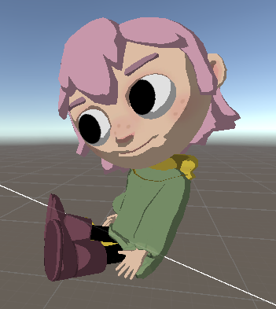

# ToonDither
Simple toon shader created for fun inside Unity 2019.4 LTS. The shader is unlit and fakes lighting through either the world light or custom inputted light position. 

Currently the shader supports both the Built-in renderer and the Universal Render Pipeline. 

  

## Details
The shader comes with a couple of different settings that can be made use of to get the desired effect. 

- Dithering Pattern - To set the desired pattern for the dithering effect
- Dithering Multiplier - To determine the intensity of the dithering
- Main Texture - For the models default texture
- Brightness - Light brightness
- Strength - The intensity of the cell shading 
- Color - Default color
- Detail - The amount of bands that the cell shading should have
- Light Position - The offset of the world light position for maximum control

With Dithering            |  Without Dithering
:-------------------------:|:-------------------------:
  |  
